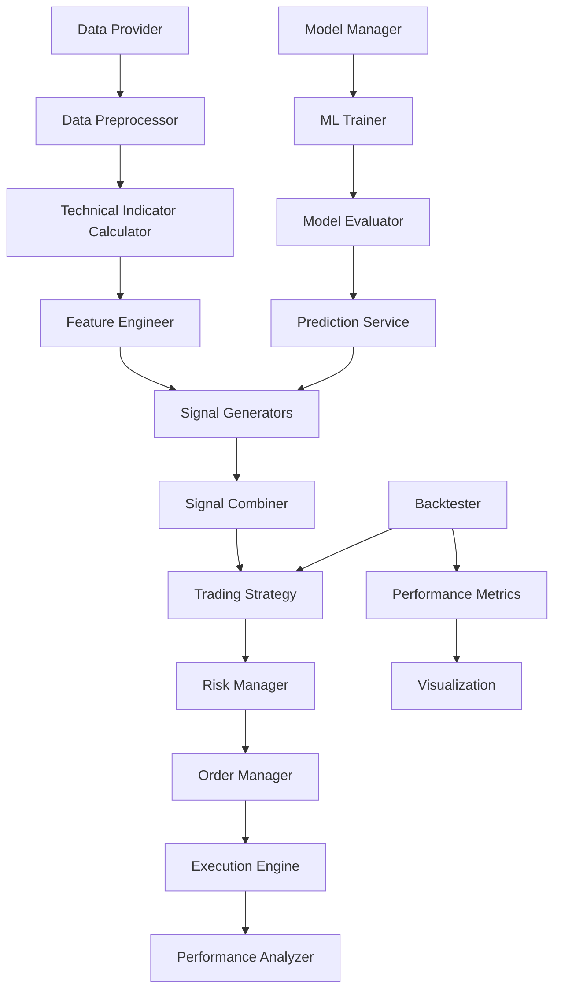

# Modular Trading System Architecture

## 📁 **Project Structure**

```
ML_Automated_Trading_Robinhood-master/
├── src/                              # Main source code
│   ├── interfaces/                   # Abstract interfaces (SOLID principles)
│   │   ├── __init__.py
│   │   ├── data_provider.py          # Data provider interface
│   │   ├── signal_generator.py       # Signal generation interface
│   │   ├── model_manager.py          # ML model management interface
│   │   ├── trading_strategy.py       # Trading strategy interface
│   │   ├── backtester.py            # Backtesting interface
│   │   └── risk_manager.py          # Risk management interface
│   │
│   ├── data/                        # Data management layer
│   │   ├── __init__.py
│   │   ├── providers.py             # YFinance, Robinhood providers
│   │   ├── analyzers.py             # Market analysis tools
│   │   └── preprocessors.py         # Data cleaning & indicators
│   │
│   ├── signals/                     # Signal generation layer
│   │   ├── __init__.py
│   │   ├── technical.py             # Technical indicators (RSI, MACD, etc.)
│   │   ├── pattern.py               # Pattern recognition (Golden Cross, etc.)
│   │   ├── ml_signals.py            # ML-based signals
│   │   └── composite.py             # Signal combination strategies
│   │
│   ├── models/                      # ML model management
│   │   ├── __init__.py
│   │   ├── managers.py              # Model lifecycle management
│   │   ├── trainers.py              # Model training pipelines
│   │   ├── predictors.py            # Prediction services
│   │   └── evaluators.py            # Model evaluation tools
│   │
│   ├── trading/                     # Trading execution layer
│   │   ├── __init__.py
│   │   ├── strategies.py            # Trading strategy implementations
│   │   ├── order_management.py      # Order sizing & management
│   │   ├── risk_management.py       # Risk controls
│   │   └── execution.py             # Trade execution (paper/live)
│   │
│   ├── backtesting/                 # Backtesting framework
│   │   ├── __init__.py
│   │   ├── engines.py               # Backtesting engines
│   │   ├── simulators.py            # Market simulators
│   │   └── analyzers.py             # Performance analysis
│   │
│   ├── analysis/                    # Analysis & visualization
│   │   ├── __init__.py
│   │   ├── performance.py           # Performance metrics
│   │   ├── visualization.py         # Chart generation
│   │   └── reports.py               # Report generation
│   │
│   └── utils/                       # Utilities
│       ├── __init__.py
│       ├── config.py                # Configuration management
│       ├── logging.py               # Logging utilities
│       ├── helpers.py               # Helper functions
│       └── exceptions.py            # Custom exceptions
│
├── tests/                           # Test framework
│   ├── unit/                        # Unit tests
│   ├── integration/                 # Integration tests
│   └── end_to_end/                  # End-to-end tests
│
├── config/                          # Configuration files
│   ├── config.yaml                  # Main configuration
│   ├── strategies.yaml              # Strategy configurations
│   └── models.yaml                  # Model configurations
│
├── scripts/                         # Utility scripts
│   ├── train_models.py              # Model training script
│   ├── run_backtest.py              # Backtesting script
│   └── live_trading.py              # Live trading script
│
├── docs/                           # Documentation
│   ├── architecture.md             # Architecture guide
│   ├── api_reference.md            # API documentation
│   └── user_guide.md               # User guide
│
└── models/                         # Model storage (existing)
    ├── trained_models/
    └── metadata/
```

## 🏗️ **Design Patterns Applied**

### 1. **Strategy Pattern**
- **Data Providers**: Interchangeable data sources (YFinance, Robinhood)
- **Signal Generators**: Different signal generation strategies
- **Trading Strategies**: Various trading approaches
- **Backtesting Engines**: Multiple backtesting methodologies

### 2. **Repository Pattern**
- **Model Management**: Persistent model storage and retrieval
- **Configuration Management**: Centralized configuration access

### 3. **Factory Pattern**
- **Signal Factory**: Creates appropriate signal generators
- **Strategy Factory**: Instantiates trading strategies
- **Data Provider Factory**: Creates data provider instances

### 4. **Observer Pattern**
- **Event System**: Market events, trade executions, risk alerts
- **Performance Monitoring**: Real-time metrics updates

### 5. **Chain of Responsibility**
- **Risk Management**: Sequential risk checks and validations
- **Signal Processing**: Multi-stage signal validation and filtering

### 6. **Command Pattern**
- **Trading Orders**: Encapsulated trading commands
- **Signal Generation**: Encapsulated signal generation commands

## 🎯 **SOLID Principles Implementation**

### **Single Responsibility Principle (SRP)**
- Each class has one reason to change
- Signal generators handle only signal generation
- Data providers handle only data retrieval
- Risk managers handle only risk assessment

### **Open/Closed Principle (OCP)**
- System is open for extension (new signal generators, strategies)
- Closed for modification (core interfaces remain stable)
- Plugin architecture for new components

### **Liskov Substitution Principle (LSP)**
- All implementations can be substituted for their interfaces
- YFinanceProvider and RobinhoodProvider are interchangeable
- Different signal generators work uniformly

### **Interface Segregation Principle (ISP)**
- Focused, minimal interfaces
- Clients depend only on methods they use
- Separate interfaces for different concerns

### **Dependency Inversion Principle (DIP)**
- High-level modules don't depend on low-level modules
- Both depend on abstractions (interfaces)
- Dependencies injected through constructors

## 🔄 **Data Flow Architecture**



## 🚀 **Key Benefits**

### **Scalability**
- Horizontal scaling: Add new signal generators, strategies, data sources
- Vertical scaling: Improve individual components without affecting others
- Cloud-ready architecture

### **Maintainability**
- Clear separation of concerns
- Loosely coupled components
- Comprehensive testing framework
- Extensive documentation

### **Extensibility**
- Plugin architecture for new components
- Easy integration of new data sources
- Flexible configuration system
- Support for custom indicators and strategies

### **Robustness**
- Multiple layers of error handling
- Comprehensive risk management
- Data validation at each stage
- Graceful degradation under failures

### **Testability**
- Mock-friendly interface design
- Unit tests for each component
- Integration tests for workflows
- End-to-end testing capabilities

## 📊 **Component Interactions**

### **Data Flow**
1. **Data Acquisition**: Multiple providers supply market data
2. **Data Processing**: Clean, validate, and enrich data
3. **Signal Generation**: Multiple generators create trading signals
4. **Signal Combination**: Composite strategy combines signals
5. **Risk Assessment**: Risk manager validates signals and orders
6. **Order Execution**: Order manager handles trade execution
7. **Performance Tracking**: Analyzer monitors and reports performance

### **ML Pipeline**
1. **Feature Engineering**: Create ML-ready features from market data
2. **Model Training**: Train and validate ML models
3. **Model Management**: Store, version, and retrieve models
4. **Prediction Service**: Generate ML-based predictions
5. **Signal Integration**: Combine ML signals with technical signals

### **Backtesting Workflow**
1. **Historical Data**: Load historical market data
2. **Strategy Simulation**: Run trading strategy on historical data
3. **Performance Analysis**: Calculate metrics and generate reports
4. **Visualization**: Create charts and dashboards
5. **Optimization**: Parameter tuning and strategy improvement

## 🔧 **Configuration Management**

### **Hierarchical Configuration**
- **Global Config**: System-wide settings
- **Component Config**: Component-specific settings
- **Strategy Config**: Trading strategy parameters
- **Environment Config**: Development/Production settings

### **Dynamic Configuration**
- Runtime parameter updates
- Hot-swapping of components
- A/B testing capabilities
- Performance tuning without restarts

## 🛡️ **Error Handling & Resilience**

### **Error Handling Layers**
1. **Input Validation**: Validate all inputs at entry points
2. **Business Logic Errors**: Handle domain-specific errors gracefully
3. **External Service Failures**: Retry logic and fallbacks
4. **System Errors**: Comprehensive logging and alerting

### **Resilience Patterns**
- **Circuit Breaker**: Prevent cascading failures
- **Retry Logic**: Automatic retry with exponential backoff
- **Graceful Degradation**: Maintain core functionality during failures
- **Health Checks**: Continuous system health monitoring

## 📈 **Performance Considerations**

### **Optimization Strategies**
- **Caching**: Cache frequently accessed data and computations
- **Parallel Processing**: Concurrent signal generation and analysis
- **Memory Management**: Efficient data structures and cleanup
- **Database Optimization**: Indexed queries and connection pooling

### **Monitoring & Profiling**
- **Real-time Metrics**: Performance dashboards
- **Resource Monitoring**: CPU, memory, disk usage
- **Latency Tracking**: End-to-end timing analysis
- **Bottleneck Identification**: Performance profiling tools

---

**🎯 Result: A professional, scalable, and maintainable trading system architecture following industry best practices and design patterns.**